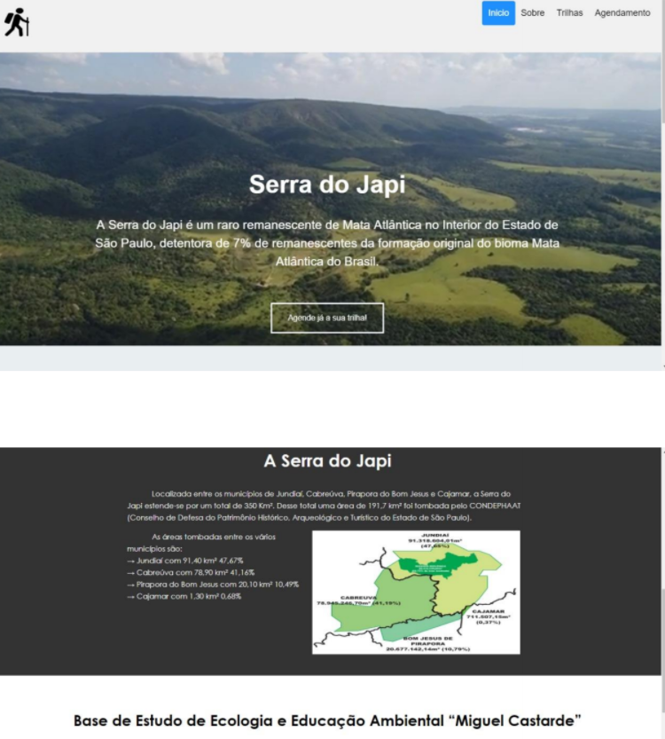
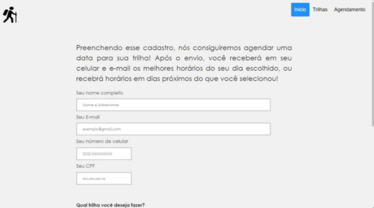
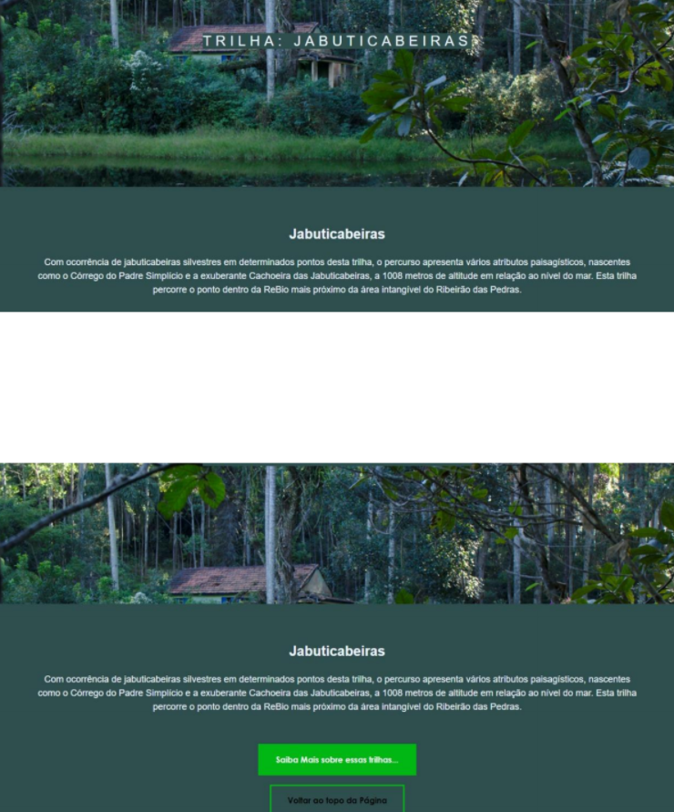

# APS-1-Semestre
## Desenvolvimento de um Site com uso de XHTML.
O trabalho proposto pedia o desenvolvimento de um site completo com a temática específica de sustentabilidade! O site feito tem como informar as pessoas sobre as principais trilhas de
Jundiaí, a importância da realização dessa ação para com a Serra do Japi e
simultaneamente para a aprendizagem sobre o tema de sustentabilidade,
possibilitando que o indivíduo tenha contato com um ecossistema importante através
do agendamento de trilhas que podem ser realizadas com facilidade.
Por meio desse contato, é esperado uma mudança de pensamento e/ou percepção
sobre a importância da sustentabilidade e preservação da natureza, uma ação que
cabe como dever a todos.

### Existe uma documentação desse projeto que contém 34 páginas! Se quiser ela, é só enviar mensagem pra mim!

#### Imagem de parte da tela inicial:

#### Imagem de parte da tela de cadastro:

#### Imagem de parte da tela de trilhas:

